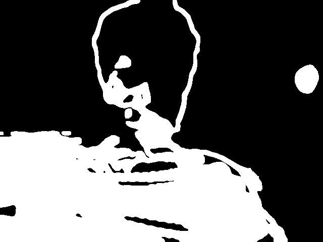
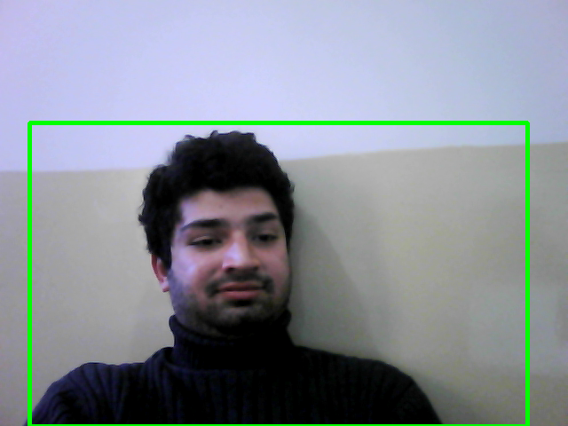

# objects-detector-python

## Desription

Using python and OpenCV checking the difference between first frame and the current frame and detecting the difference that we may consider objects.


>## Libraries used
<font size="4" color="#00A0B2" face="Verdana">OpenCV</font>
OpenCV (Open Source Computer Vision) is a library of programming functions mainly aimed at real-time computer vision.
<font size="4" color="#00A0B2" face="Verdana">Numpy</font>
OpenCV-Python makes use of Numpy, which is a highly optimized library for numerical operations with a MATLAB-style syntax. All the OpenCV array structures are converted to and from Numpy arrays. This also makes it easier to integrate with other libraries that use Numpy such as SciPy and Matplotlib.


## Starting with the code

### We will first start with Importing the libraries


```python
import cv2
import numpy as np
```


```python
# VideoCapture is a method that addresses and link with the webcam source
video = cv2.VideoCapture(1)
```


```python
#declare the variable in which we will store the first frame
first_frame = None
#'None' signifies that the variable doesn't hold any value as of now.
status_list = []
```


```python
while True:
    #Capture frame by frame
    check, frame = video.read()
    status = 0

```

###### Running the frame
```python
cv2.imshow("Original frame", frame)
```  
<font size="4" color="#00A0B2" face="Verdana">Output</font>


Above is the Original frame that we are getting through Source


```python
#Converting frames(images) to Gray
    gray = cv2.cvtColor(frame, cv2.COLOR_BGR2GRAY)
```


```python
    # Blur image to reduce noise and increase accuracy
    gray = cv2.GaussianBlur(gray, (21, 21), 0 )
```

<font size="4" color="#00A0B2" face="Verdana">Output</font>


We see above that the image is blurred out and grayed just to get certain information only that we require for objects detection


```python
    #In first iteration, store first frame in variable
    if first_frame is None:
        first_frame = gray
        #In second iteration, first_frame is no longer None type, so it will continue without affecting the first_frame
        continue
```

### What is the Absolute Difference
Frames return the type called np.array that is a datatype defined in numpy

We want to check and differentiate b/w the first frame that we stored and the current frame
For this, opencv give us the method that is **'absdiff'** called Absolute difference

<font size="4" color="#00A0B2" face="Verdana">Example</font>


```python
    #Comparing blurray scale images
    delta_frame = cv2.absdiff(first_frame, gray)
```

<font size="4" color="#00A0B2" face="Verdana">Output</font>


### Thresholding

From here the matter is straight forward. If pixel value is greater than a threshold value, it is assigned one value (may be white), else it is assigned another value (may be black). The function used is cv2.threshold. First argument is the source image, which should be a grayscale image. Second argument is the threshold value which is used to classify the pixel values. Third argument is the maxVal which represents the value to be given if pixel value is more than (sometimes less than) the threshold value. OpenCV provides different styles of thresholding and it is decided by the fourth parameter of the function. Different types are:

Python has a very simple implementation: 
```
    cv2.THRESH_BINARY
    cv2.THRESH_BINARY_INV
    cv2.THRESH_TRUNC
    cv2.THRESH_TOZERO
    cv2.THRESH_TOZERO_INV
```
Documentation clearly explain what each type is meant for. Please check out the [documentation](https://docs.opencv.org/3.3.1/d7/d4d/tutorial_py_thresholding.html).

See the code below:


```python
    thresh_frame = cv2.threshold(delta_frame, 30, 255, cv2.THRESH_BINARY_INV) [1]
    
```

Two outputs are obtained. First one is **retval**. Second one is the **Thresholded image** so we need only second value in the tuple so we retreive second value only and store it in variable.

### Dilation

Dilation is a part of Morphological Transformations. Basic idea of dilation is just the opposite of erosion. Erosion can be idea that a pixel in the original image (either 1 or 0) will be considered 1 only if all the pixels under the kernel is 1, otherwise it is eroded (made to zero).

Dilation is just opposite of erosion. Here, a pixel element is '1' if atleast one pixel under the kernel is '1'. So it increases the white region in the image or size of foreground object increases. Normally, in cases like noise removal, erosion is followed by dilation. Because, erosion removes white noises, but it also shrinks our object. So we dilate it. Since noise is gone, they won't come back, but our object area increases. It is also useful in joining broken parts of an object.

Other types of Morphological Transformations are explained in the documentation. Please checkout the [documentation](https://docs.opencv.org/3.3.1/d9/d61/tutorial_py_morphological_ops.html)


```python
    thresh_frame = cv2.dilate(thresh_frame, None, iterations=2)
```

<font size="4" color="#00A0B2" face="Verdana">Result</font>


Seeing the result above we can clearly see the similiar objects having same color and intensity. Now we can do **Shape analysis and object detection**. For this OpenCV give us the tool called **Contours**.

### Contours

From here on, we do Shape analysis. Contours can be explained simply as a curve joining all the continuous points (along the boundary), having same color or intensity. The contours are a useful tool for shape analysis and object detection and recognition.

Please checkout the [documentation](https://docs.opencv.org/3.3.1/d4/d73/tutorial_py_contours_begin.html)


```python
    # We use copy() method so that it creates new copy of frame and operate on it rather than overwriting it
    (_,cnts,_) = cv2.findContours(thresh_frame.copy(),cv2.RETR_TREE, cv2.CHAIN_APPROX_TC89_KCOS)
```


```python
    for contour in cnts:
        if cv2.contourArea(contour) < 220:
            status=0
            continue
        status = 1
        (x,y,w,h) = cv2.boundingRect(contour)
        cv2.rectangle(frame, (x,y), (x+w,y+h), (0,255,0),3) # Drawing rectangle over objects
        # cv2.circle(frame, (x,y), (h), (0,255,0),3) # Drawing circle over objects We can use circles to on Contours
```

So what is happening in the above code?
- We iterate through each contour.
- If the Contour Area is less than 220 then ignore it.
- If Contour Area is bigger than 220 then:
    - Then we set scatter the boundries and store in each variable the returned data (in tuple form) from each contour in x,y,w,h.


```python
    #Append the status in current iteration to status_list
    status_list.append(status)
```

- In the above code, we just simply append the status either 0 (No objects present) or 1 (Objects present) for the time being the objects are present in front of camera

#### From the now on we start dealing with the **User Interface**


```python
    cv2.imshow("Gray frame", gray)
    cv2.imshow("Delta frame", delta_frame)
    cv2.imshow("Threshold frame", thresh_frame)
    cv2.imshow("Color frame", frame)
```

In the above code, imshow is a GUI feature in OpenCV through which we show window frames

### Waitkey
- Waitkey(n) ,where 'n' is the delay in milliseconds, is a method that checks for key input that return an integer representing the Unicode code point of the character when the argument is a unicode object, or the value of the byte when the argument is an 8-bit string.
    For example, ord('a') returns the integer 97
    
<font size="4" color="#00A0B2" face="Verdana">Example</font>


```python
    #If the key is q then close the window
    key= cv2.waitKey(1)

    if key == ord("q"):
        break
```


```python
#Print the status_list for list of times the object stayed in front of cam
print(status_list)
```


```python
#Relase the webcam resource to make it available for other programs
video.release()

#Destroy all opened window frames
cv2.destroyAllWindows()

```

In the above code, we perform the following operation:
- We release webcam resources that were reserved by this program.
- We destroy all the the opened windows frames

<font size="4" color="#00A0B2" face="Verdana">Result</font>


## Conclusion

Thanks to the team of OpenCV and Numpy that provides us different methods defined in it that make our work too easy for image processing and performing different operations on image. Objects Detection operation is well explained in this document and Reference to many common and famous techniques to Official Documentation are given. You can go to references to further study it. Through practice you can easily learn how to manipulate images and processing an image
